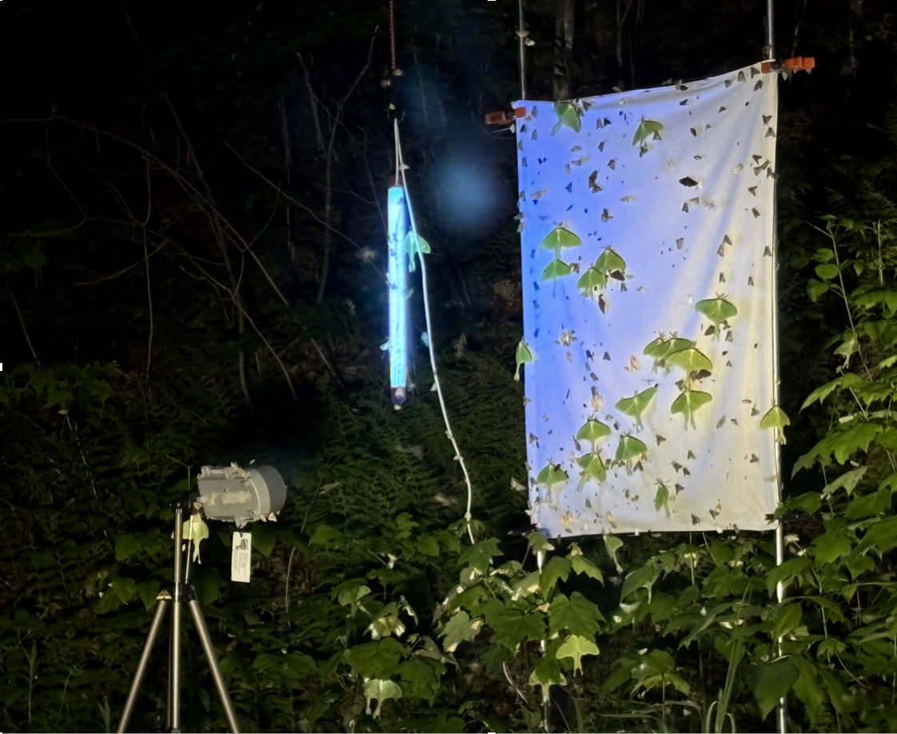
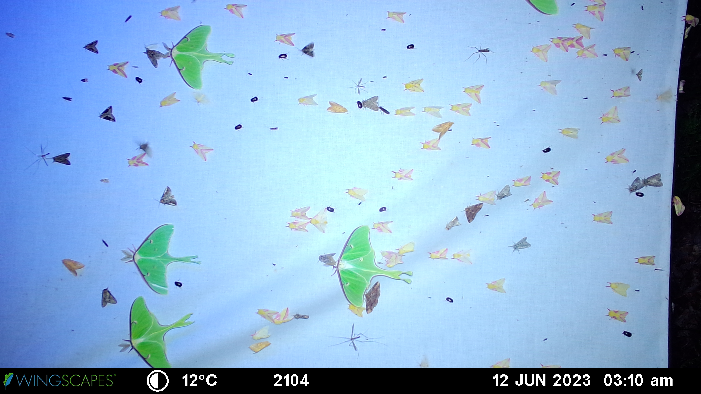
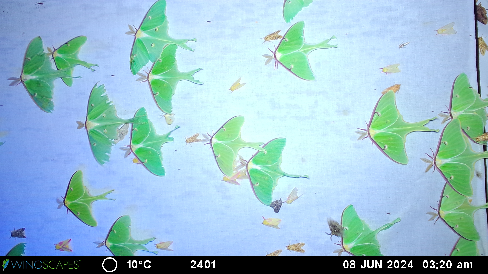
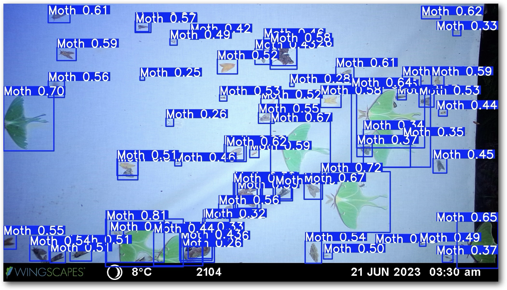
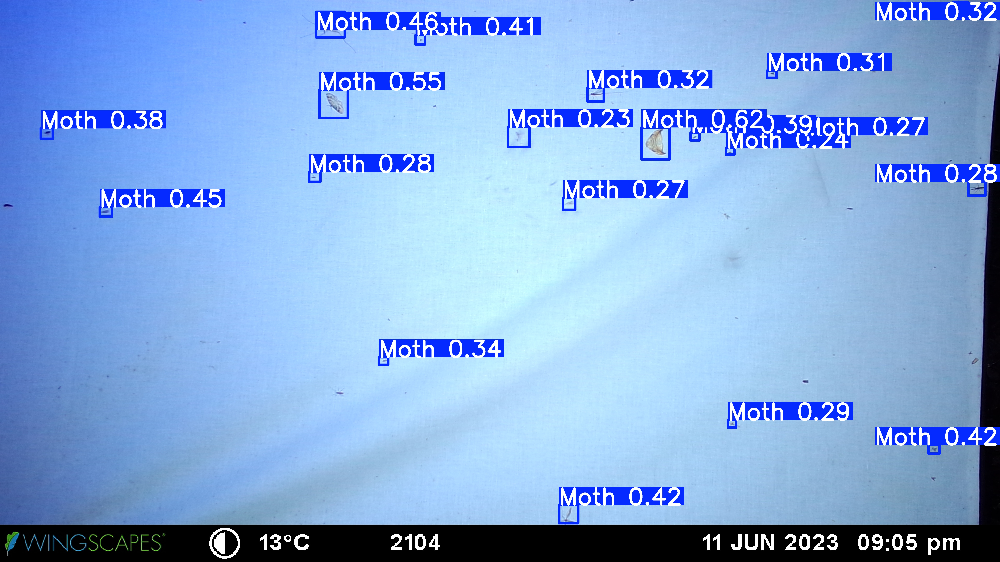
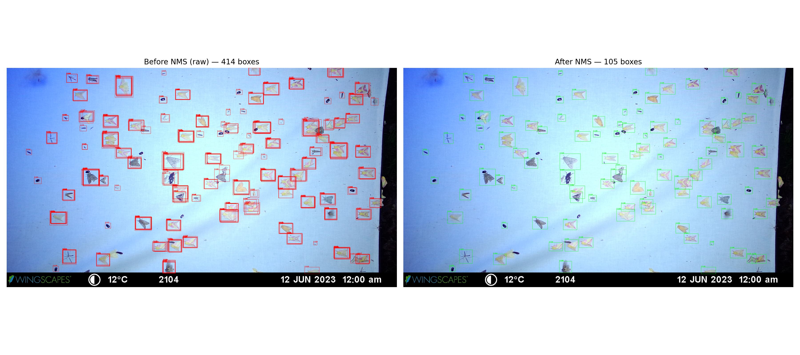
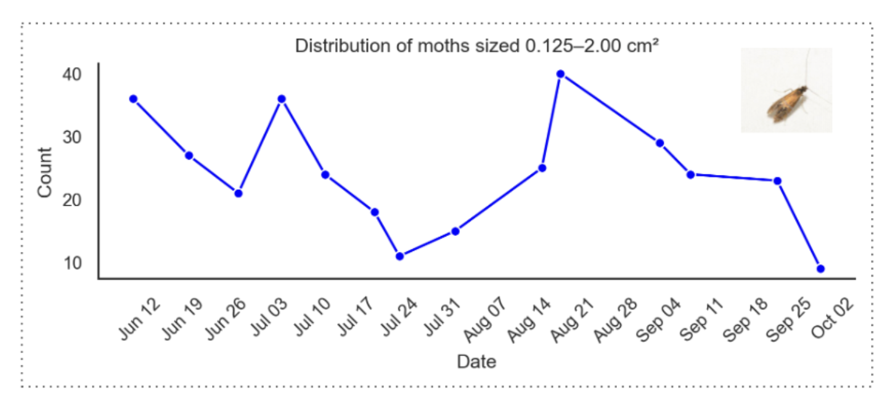
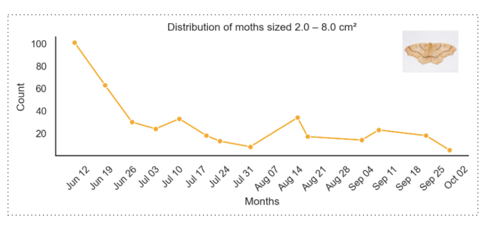
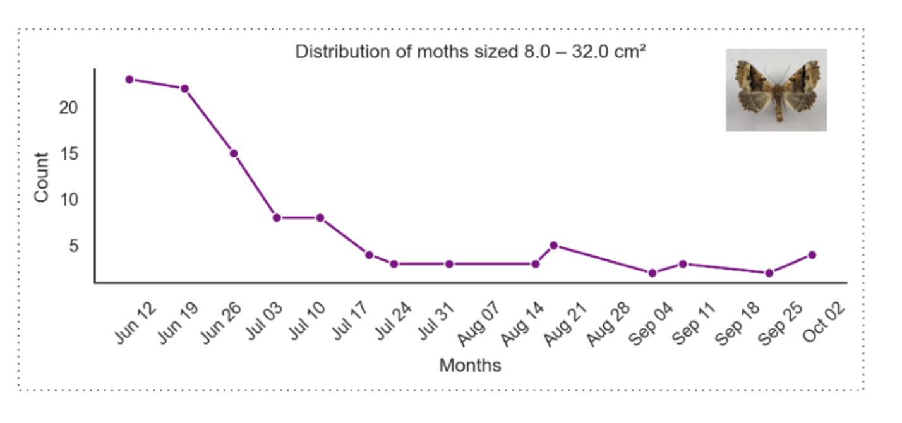
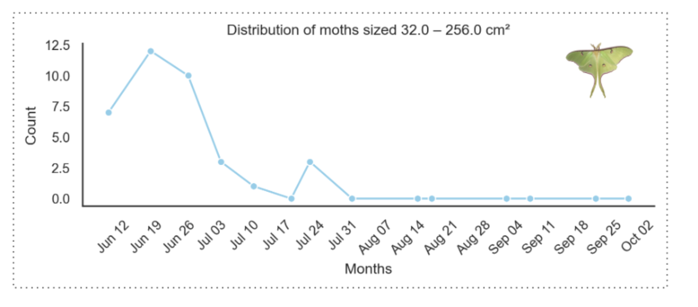

# Blacklight Sheet Imagery for Tracking Lepidoptera (Moth) Abundance at Hubbard Brook

This repository uses blacklight-sheet invertebrate imagery from the Hubbard Brook Experimental Forest to estimate Lepidoptera (moth) **relative abundance indices** via an object-detection pipeline (inference + NMS), aggregation to site-level time series, and trend visualization/validation.

**Dataset (DOI, EDI):** https://doi.org/10.6073/pasta/7ac5818bb45bb42c2d935ce7e3756c00

---

## What’s in this repository

- **Data access**: scripts to fetch the full EDI data package (ZIP) using the DOI  
- **Inference**: object detection + NMS to produce detections from images  
- **Aggregation**: detections → counts → site-level time series  
- **Results**: plots/figures to visualize trends and compare across sites  

> Note: The full image dataset is **not** stored in this GitHub repository. It is retrieved from EDI using the DOI above.

---

## Setup

### Requirements
- A laptop/desktop
- Python 3.x (recommended: Conda)

> How to install Conda:  https://docs.conda.io/en/latest/miniconda.html

### Create an environment (recommended)

```bash
conda create -n moths python=3.10 -y
conda activate moths
```

### Install Python dependencies

```bash
pip install -r requirements.txt
```

## Data

### Directory Layout

```text
data/
  quicklook/
  citation.txt
  fetchData.md
```
- data/quicklook/ — optional small subset / sample images for sanity check
- data/downloads/ — where downloaded ZIPs and extracted data can live (gitignored)
- data/citation.txt — dataset citation and DOI
- data/fetchData.md - lists the 2 methods to download dataset

### Make your own Dataset!
You will need a standardized blacklight-sheet imaging setup consisting of: 
1. A lamp/light source
2. A plain sheet with faint threads (the illuminated surface)
3. a camera, and 
4. A fixed sampling site.

It should look something like this:




### Or Use Ours ?
#### Details From the Field:

**Study sites:** Sampling was conducted at five sites within Hubbard Brook Experimental Forest:
- Watershed 1 (WS1)
- Watershed 4 (WS4)
- Watershed 5 (WS5)
- Top of Watershed 6 (WS6up)
- Bottom of Watershed 6 (WS6low)


**Period of Collection:** The dataset was collected between mid-june and mid-september, biweekly, for approximately 14 nights. The camera is started at 10:00pm each of these nights and shut off at 4:00 am. It is programmed to take a picture every 10 minutes between these hours.

**Hardware and geometry (per site):**
- **Support structure:** Two wooden support tubes/posts, spaced 63 cm apart, used to mount the sheet.
Sheet size: 38×28 in or 96×72 cm (including the margin used for wrapping/mounting).
- **Sheet height:** Sheet bottom positioned approximately 62 cm above ground, with the sheet center at approximately 110 cm above ground.
- **Illumination:** A lamp positioned to illuminate the full sheet surface uniformly.
- **Camera:** Nikon camera placed 130 cm from the sheet, oriented in portrait, facing the sheet.
Effective image frame: Approximately 44×83 cm of the sheet area was captured in the camera frame.

> Distances and mounting geometry were kept consistent across sites to support comparability of moth counts between locations.

Our setup has generated images like these:






## Model and Inferencing

### Directory Layout

```text
models/
    best.torchscript
    data.yml

notebooks/
    runInference.ipynb
    extractTrends.ipynb
```

### Train your Own Model!

#### How to ? 
Learn Here! https://docs.ultralytics.com/models/yolo11/
The dependencies have been taken care of for you in requirements.txt.

#### Compare Against Ours (Metrics):
F1 Score: 91% for a confidence Score threshold of 23%. In Plain English, When our model is a 23% or more sure of it's detected object, we are a 91% confident it is a moth. 

### Or Use Ours ?

Use the notebook: ```runInference.ipynb```

**Details**
- Model Trained: YOLOv11 by Ultralytics.
- Confidence Threshold set at 23%
- NMS Threshold set at 50%

Model at Work:



Duplicate or Ovelapped Boxes are reduced using NMS (included in runInference.ipynb)

NMS Script at Work:


## Generating Trends

Use the notebook: ```extractTrends.ipynb```

### Size and Mass Categorization
For a Size and mass estimation of the moths captured by YOLOv11, we mapped bounding box sizes to area on sheets, which gave us relative figures for the size of moths. It gives us 4 size and mass brackets which are represented for trends separately.

### Results

The notebook concludes with producing abudnace trends from all the sites within the year input or the specified time-frame, as below:






We have found these patterns consistent with the findings from previously used manual counts and bucket-light traps!

-------------------------------------------------------------------------------------------------
We are curious to find out about your local Lepidoptera Abundance patterns!